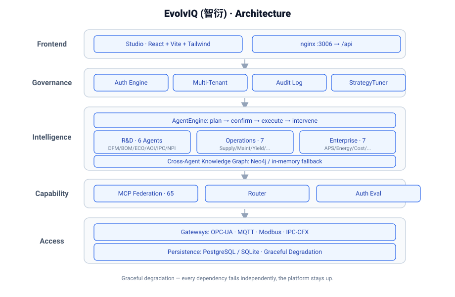
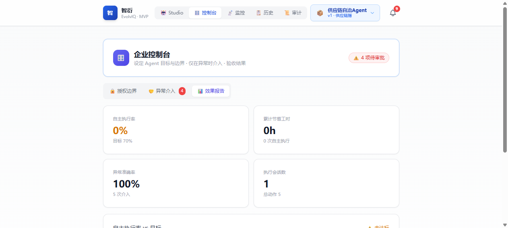

# EvolvIQ (智衍) · AI-Native Industrial Agent Platform

> **The world's first open-source, AI-native industrial agent platform** — 25 pre-built agents spanning L2 (shop-floor protocols) to L4 (enterprise decision intelligence), designed for electronics manufacturing and semiconductors.

[](LICENSE)
[](https://www.python.org/)
[](https://fastapi.tiangolo.com/)
[](https://github.com/iduyuhe/zhiyan-evolviq/actions/workflows/ci.yml)
[](https://github.com/iduyuhe/zhiyan-evolviq)
[](https://github.com/iduyuhe/zhiyan-evolviq)
[](RELEASE_NOTES.md)

> 🏷 **Latest release: [v20.5 — Production Data Layer (P1) + Multi-Tenant & Live Graph (P2)](RELEASE_NOTES.md)** (2026-08-05) · 25 Agents · Memory (P0) + Self-Learning (P1) + Self-Evolution (P2) + Production Data Layer closed loop
>
> 📖 **User Guide**: [docs/GUIDE.md](docs/GUIDE.md) · [中文指南](docs/GUIDE.zh.md)

---

## ✨ Features

- **25 Industrial Agents**: Pre-built autonomous agents for supply chain, R&D, manufacturing, quality, and enterprise decision-making — spanning shop-floor protocols to enterprise decision intelligence
- **65 MCP Tools**: Standardized tool federation via the Model Context Protocol (HTTP + stdio dual transport)
- **4 Industrial Protocol Gateways**: Modbus, MQTT, OPC-UA, IPC-CFX — real or simulated mode
- **Multi-Agent Orchestration**: 8 preset collaboration templates (NPI / OEE / Quality / Energy / ECO ...) — automatic goal decomposition, parallel agent execution, and cross-agent insight aggregation
- **Cross-Agent Knowledge Graph**: Neo4j-backed semantic network with automatic in-memory fallback
- **Experience Memory & Recall (P0)**: Every agent execution + multi-agent orchestration writes back cross-agent insights (`Insight` nodes); agents recall relevant history before reasoning via `BaseAgent.recall(goal)` / `/kg/recall` — the memory loop is closed
- **Persistent Effects & Audit**: Metrics (autonomy rate, time saved) and audit logs survive restart via SQLite fallback — effect-driven tuning builds on real history, not a blank slate
- **Authorization Engine**: Per-agent confidence thresholds, daily autonomy limits, and approval boundaries — real-time AI behavior guardrails
- **Graceful Degradation**: Every external dependency (PostgreSQL, Neo4j, OPC-UA Server, AMQP Broker) automatically degrades to local alternatives — never blocks startup or execution
- **Multi-Tenant**: Row-level `tenant_id` isolation with API-Key authentication (`X-Tenant-Key` header)
- **Effect-Driven Strategy Tuning**: Live knob adjustment (confidence thresholds, daily limits) with audit trail
- **Self-Learning Loop (P1)**: Human approve/reject in the Intervention Center auto-feeds an agent's preference/forbidden memory; the strategy tuner auto-adjusts guardrails (with one-click rollback) — the system learns from experience, it does not just execute
- **Self-Evolution Loop (P2)**: LLM replays human-rejected cases to propose a revised agent system prompt — versioned, human-approved (never auto-applied), with hot-swap + one-click rollback; plus RAG knowledge self-update (verified facts upserted into the knowledge graph) and online preference learning (rolling approval-rate signal)
- **Production Data Layer (P1)**: A unified `DataSource` bus connects MES / ERP / PLM / WMS (config-driven REST connectors, env-injected) and a time-series store (in-memory ring buffer + optional InfluxDB) — agents auto-switch seed→live, closing the previous gateway/seed disconnect. Every connector degrades gracefully (no source = safe fallback to seed)
- **Live Knowledge Graph & Multi-Tenant Data (P2)**: The knowledge graph ingests live data from the `DataSource` bus (periodic sync, never rewrites business numbers); each tenant can configure its own MES/ERP/WMS/time-series connections via `GET/POST/DELETE /data-sources` (persisted, rehydrated on restart)
- **Apache-2.0 Licensed**: Fully open-source, no vendor lock-in

---

## 🧩 Agent Lineup (25 Agents)

### Shop-Floor Operations (11 Agents)

| Agent | Domain | Core Capability |
|-------|--------|----------------|
| `supply_chain` | Supply Chain | BOM kitting, shortage alerts, alternative sourcing |
| `pm_maintenance` | Equipment | Predictive maintenance, health scoring, spare-part lifecycle |
| `yield_analysis` | Yield | Wafer yield trend analysis, defect classification, root-cause |
| `quality_trace` | Quality | End-to-end traceability: complaint→batch→process→equipment |
| `dfm_check` | DFM | PCB/PCBA design rule checking (solder pads, trace width, solder mask) |
| `bom_selector` | BOM | Component selection, pin-to-pin alternatives, EOL alerts |
| `oee_optimizer` | OEE | Overall equipment effectiveness, six big losses analysis |
| `eco_change` | ECO | Engineering change impact analysis (BOM/WIP/inventory) |
| `smt_changeover` | SMT | Changeover optimization, SMED, feeder pre-configuration |
| `aoi_judge` | AOI | Automated optical inspection false-call filtering, threshold optimization |
| `ipc_standard` | IPC Standards | IPC-A-610 defect judgment, Class 1/2/3 grading |

### Enterprise Decision Brain (9 Agents)

| Agent | Domain | Core Capability |
|-------|--------|----------------|
| `aps_scheduler` | Scheduling | Production scheduling, capacity planning, CTP commitment |
| `energy_carbon` | Energy & ESG | Energy monitoring, carbon footprint, green ratio, ESG compliance |
| `cost_analysis` | Cost | Unit cost breakdown (BOM/labor/equipment/energy/scrap), cost reduction |
| `demand_order` | Demand & Orders | S&OP demand vs booked, backlog risk, supply rebalancing |
| `wms_logistics` | Warehouse & Logistics | Inventory health, turnover, safety-stock auto-replenishment |
| `compliance_q` | Quality Compliance | ISO certification tracking, audit findings, RoHS/REACH, auto CAPA |
| `executive_cockpit` | Executive Dashboard | KPI dashboard, budget execution, production output vs plan |
| `rd_npi` | R&D NPI | NPI project lifecycle, milestone tracking, risk identification |
| `procurement_manage` | Procurement | Supplier scorecard (delivery/quality/cost/compliance), contract management |

### Platform & Governance (5 Agents)

| Agent | Domain | Core Capability |
|-------|--------|----------------|
| `industry_research` | Industry Insight | Industry benchmarking & gap analysis — surfaces sector-level opportunities |
| `case_curator` | Case Library | Builds & governs the research case library with strict anonymization (zero real names) |
| `enterprise_onboarding` | Onboarding | "Register-to-onboard": auto-recommends avatars & permissions per enterprise |
| `compliance_reviewer` | Compliance Review | Reviews external-facing materials, guarding red lines (e.g. zero real names) |
| `bid_intel` | Bid Intelligence | Consumes public signals (voice / benchmark / market) to surface business opportunities |

---

## 🎼 Multi-Agent Orchestration (V1.5)

> **The leap from "25 isolated agents" to "one collaborative team"**: a single goal like *"improve OEE"* automatically triggers 5 agents (OEE + changeover + maintenance + yield + energy) to work in parallel, then aggregates cross-domain insights into one report.

**8 preset collaboration templates** out of the box — just describe your goal, the platform picks the right team:

| Template | Trigger Words | Agents Involved |
|----------|---------------|-----------------|
| **NPI Full Evaluation** | npi, 新品导入, 量产放行, 试产 | dfm_check + bom_selector + rd_npi + smt_changeover + cost_analysis |
| **Kitting & Delivery** | 齐套, 缺料, 交期, 未交付 | supply_chain + demand_order + aps_scheduler + wms_logistics + procurement_manage |
| **OEE Improvement** | oee, 产线效率, 六大损失 | oee_optimizer + smt_changeover + pm_maintenance + yield_analysis + energy_carbon |
| **Energy & Carbon** | 能耗, 碳排放, 双碳, 绿电 | energy_carbon + oee_optimizer + cost_analysis + compliance_q |
| **Quality / Complaint RCA** | 客诉, 投诉, 退货, 不良批次 | quality_trace + yield_analysis + compliance_q + ipc_standard + executive_cockpit |
| **Executive Cockpit** | 经营, 驾驶舱, kpi, 月报, 利润 | executive_cockpit + cost_analysis + demand_order + aps_scheduler + compliance_q |
| **ECO Impact Analysis** | eco, ecn, 工程变更, 物料切换 | eco_change + bom_selector + dfm_check + aps_scheduler + compliance_q |
| **Equipment Failure RCA** | 故障, 停机, 维修, 设备异常 | pm_maintenance + yield_analysis + quality_trace + aoi_judge |

**Three-tier decomposition** (resilient fallback):
1. **Preset templates** — 8 most common scenarios, zero LLM cost
2. **LLM-enhanced** — for complex long-form goals, LLM picks the team
3. **Keyword aggregation** — always-available rule-based fallback

```bash
# Quick try (Local Python)
curl -X POST http://localhost:8000/sessions/multi-agent \
  -H "Content-Type: application/json" \
  -d '{"goal": "新产品导入评估"}'
# Returns: { session_id, plan: { sub_tasks: [...], rationale: "..." } }

curl -X POST http://localhost:8000/sessions/{session_id}/approve-multi \
  -H "Content-Type: application/json" \
  -d '{"approved": true}'
# Returns: { report: { summary, cross_findings, key_metrics, priority_actions, ... } }
```

See [`docs/MULTI_AGENT_ORCHESTRATION.md`](docs/MULTI_AGENT_ORCHESTRATION.md) for the full design.

---

## 🚀 Quick Start

### Option 1: Local Python (simplest, auto-degradation)

```bash
python -m venv .venv && source .venv/bin/activate
pip install -e ".[dev]"
cp .env.example .env        # Fill in your LLM_API_KEY at minimum
python -m src.runtime.main
# Open http://localhost:8000/docs
```

No PostgreSQL or Neo4j required — the platform runs with **SQLite + in-memory graph + simulated gateways**; set `ZHIYAN_DEMO_DATA=1` for demo data.

### Option 2: Docker (full stack with PG + Neo4j + frontend)

```bash
cp .env.example .env        # Fill in your LLM_API_KEY
docker compose up -d
# Frontend: http://localhost:8080     API: http://localhost:8000
```

---

## 👋 如何参与

来了先别迷路 —— 四件事，任选你能做的：

- 🐛 **提 Bug** → [Issues](https://github.com/iduyuhe/zhiyan-evolviq/issues)
- 💡 **提需求** → [Discussions](https://github.com/iduyuhe/zhiyan-evolviq/discussions)
- 🛠 **写代码** → 认领 [Good First Issue](https://github.com/iduyuhe/zhiyan-evolviq/labels/good%20first%20issue)
- ⭐ **用得好** → 点个 [Star](https://github.com/iduyuhe/zhiyan-evolviq)
- 💬 **中文社区 / 教程案例** → 微信搜索公众号「工业5点0产业生态联盟」，获取上手教程、行业案例与活动

---

## 📋 Issue 导航（17 个可认领任务）

> 当前仓库共有 **17 个开放 Issue** 等待社区共建 —— 按方向分四组。带 🟢 `good first issue` 的零经验也能上手；带 🟡 `help wanted` 的欢迎有相关经验的伙伴认领；带 💡 `from-customer` 的是真实客户需求。点标题直达。

### 📘 文档与教程（6）
| # | 标题 | 标签 |
|---|------|------|
| [#1](https://github.com/iduyuhe/zhiyan-evolviq/issues/1) | 为 25 个 Agent 各写一个端到端运行示例 | 🟢 good first issue · documentation |
| [#2](https://github.com/iduyuhe/zhiyan-evolviq/issues/2) | 补全 Studio 英文界面文案（i18n） | 🟢 good first issue · documentation |
| [#8](https://github.com/iduyuhe/zhiyan-evolviq/issues/8) | 基于 supply_chain 模板写「如何新增一个 Agent」教程 | 🟢 good first issue · documentation |
| [#10](https://github.com/iduyuhe/zhiyan-evolviq/issues/10) | 前端英文 i18n（统一英文字符串） | 🟢 good first issue |
| [#11](https://github.com/iduyuhe/zhiyan-evolviq/issues/11) | demo 走查视频脚本 + GIF | 🟢 good first issue · documentation |
| [#52](https://github.com/iduyuhe/zhiyan-evolviq/issues/52) | 翻译 / 补全英文文档（README 与 docs） | 🟢 good first issue · documentation |

### 🔌 连接器与集成（6）
| # | 标题 | 标签 |
|---|------|------|
| [#3](https://github.com/iduyuhe/zhiyan-evolviq/issues/3) | 新增 MES/ERP 实时数据适配器骨架（AI 辅助生成方向） | 🟢 good first issue · enhancement |
| [#4](https://github.com/iduyuhe/zhiyan-evolviq/issues/4) | 数据源配置 UI 连通性验证（先测试后保存闸门） | 🟢 good first issue |
| [#5](https://github.com/iduyuhe/zhiyan-evolviq/issues/5) | 企微 / 钉钉 隐性信号接入连接器 | 🟢 good first issue |
| [#6](https://github.com/iduyuhe/zhiyan-evolviq/issues/6) | 邮件渠道隐性捕获连接器 | 🟢 good first issue |
| [#7](https://github.com/iduyuhe/zhiyan-evolviq/issues/7) | 监控指标 Prometheus exporter | 🟢 good first issue |
| [#9](https://github.com/iduyuhe/zhiyan-evolviq/issues/9) | 路由精度增强：消解近义目标 | 🟢 good first issue |

### 🛠 贡献脚手架 & 本体（2）
| # | 标题 | 标签 |
|---|------|------|
| [#12](https://github.com/iduyuhe/zhiyan-evolviq/issues/12) | 「贡献你的 Agent」脚手架 | 🟡 help wanted |
| [#13](https://github.com/iduyuhe/zhiyan-evolviq/issues/13) | 本体扩展提议工作流文档 | 🟡 help wanted · documentation |

### 💡 来自客户 / 社区的方向（3）
| # | 标题 | 标签 |
|---|------|------|
| [#51](https://github.com/iduyuhe/zhiyan-evolviq/issues/51) | 建议增加替代料推荐（来自真实客户） | 💡 from-customer · enhancement |
| [#53](https://github.com/iduyuhe/zhiyan-evolviq/issues/53) | 扩充研究案例库（3C / 新能源 / 通讯 等行业锚定） | 🟢 good first issue · documentation |
| [#54](https://github.com/iduyuhe/zhiyan-evolviq/issues/54) | 制作对外物料：一页纸介绍 / 竞品对比卡 / Demo 视频 | 🟡 help wanted · documentation |

> 小提示：Issue 不带 `track:future-ideas` 标签的，都是「可立即认领、可落地」的任务；带该标签的是规划/方向类，欢迎讨论但不急着认领。

---

## 🙏 致谢 / Contributors

EvolvIQ 由社区共建，特别感谢早期朋友让这个项目有了第一批观众与更稳的代码：

- ⭐ 首批 Star：**@elysium3927 @madhanio @Yangj2003** —— 你们是这个项目最早的一批观众，非常感谢。
- 🐛 **@xingswxingsw** —— 提交了一系列高质量 bug 报告（#44–#50：网关前缀、子路径部署、认证解包、监控告警、顶栏布局……），每一个都精准命中真实问题，平台因此更稳。欢迎继续提 issue！
- 🤝 每一位提 Issue、PR 与建议的朋友 —— 这个项目是活的，我们会持续维护。

> 想被写进致谢？提一个被合并的 PR，或报告一个被修复的 bug，我们就会把你加进来。

---

## 🏗 Architecture



### Live Console



**Key design principles:**
- **Deterministic by default**: All agent analysis runs on seed/production data with zero LLM hallucination
- **Facts are facts**: Every number and action is traceable, auditable, and verifiable
- **Graceful degradation**: Every dependency can fail independently — platform stays up
- **MCP-standardized**: All 65 tools exposed via Model Context Protocol (HTTP + stdio)

---

## 📚 Documentation & Community

- 🗺 Roadmap: [ROADMAP.md](ROADMAP.md)
- 🔒 Security: [SECURITY.md](SECURITY.md)
- 📝 Changelog: [CHANGELOG.md](CHANGELOG.md)
- 🏷 Release Notes: [RELEASE_NOTES.md](RELEASE_NOTES.md)
- 📖 User Guide: [docs/GUIDE.md](docs/GUIDE.md) · [中文](docs/GUIDE.zh.md)
- 📘 Application Whitepaper: [docs/WHITEPAPER.md](docs/WHITEPAPER.md)
- 📗 Technical Whitepaper: [docs/TECHNICAL_WHITEPAPER.md](docs/TECHNICAL_WHITEPAPER.md)
- ⚡ Practicality Assessment: [docs/PRACTICALITY_ASSESSMENT.md](docs/PRACTICALITY_ASSESSMENT.md)
- 🌍 Global Alignment: [docs/GLOBAL_ALIGNMENT_REPORT.md](docs/GLOBAL_ALIGNMENT_REPORT.md)
- 🏢 Enterprise Application Guide (CIO / implementation): [docs/ENTERPRISE_GUIDE.zh.md](docs/ENTERPRISE_GUIDE.zh.md)
- 🛡 Risk & Governance Whitepaper (EN): [docs/RISK_GOVERNANCE_WHITEPAPER.md](docs/RISK_GOVERNANCE_WHITEPAPER.md)
- 🛡 风险与治理白皮书 (ZH): [docs/RISK_GOVERNANCE_WHITEPAPER.zh.md](docs/RISK_GOVERNANCE_WHITEPAPER.zh.md)
- 📊 Datasheet & Competitive Comparison: [docs/DATASHEET.md](docs/DATASHEET.md)
- 🌐 Custom Domain Setup Guide: [docs/DOMAIN_GUIDE.md](docs/DOMAIN_GUIDE.md)
- 🖼 Social preview image: `og_image.png` (upload in repo **Settings → Social preview**)
- 🎬 Demo & explainer videos: see release assets / contact maintainers

## 🏛 治理 / Governance

EvolvIQ 是社区驱动的开源项目，治理原则公开透明：

- **方向讨论** → GitHub [Discussions](https://github.com/iduyuhe/zhiyan-evolviq/discussions) 与 [Issues](https://github.com/iduyuhe/zhiyan-evolviq/issues)。重大变更先提 RFC（在 Discussions 开帖），再动手。
- **人在回路**：任何自动进化（提示词 / 策略 / 知识图谱更新）都只进入 `proposed`，必须经人审批（`approve → apply`）才会生效——平台不会自己改业务数字。
- **决策透明**：Roadmap 公开、Release Notes 公开、贡献入口公开。
- **许可证**：Apache-2.0，永久全开源，无厂商锁定。

## 🛡 License

Apache 2.0. See [LICENSE](LICENSE).

---

*Built for the next generation of intelligent manufacturing. EvolvIQ is a trademark of Shanghai Dute Technology Co., Ltd.*
